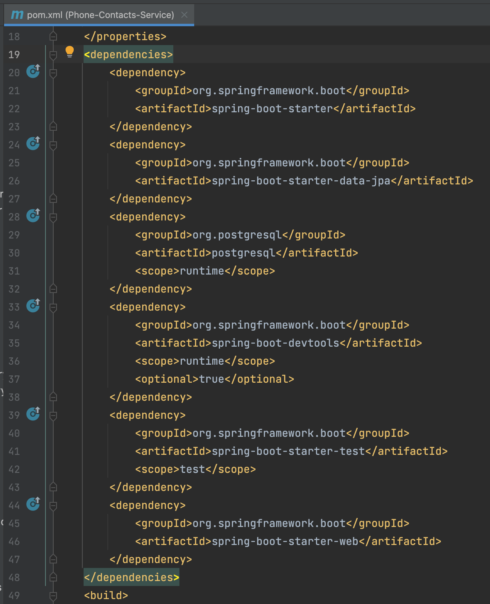
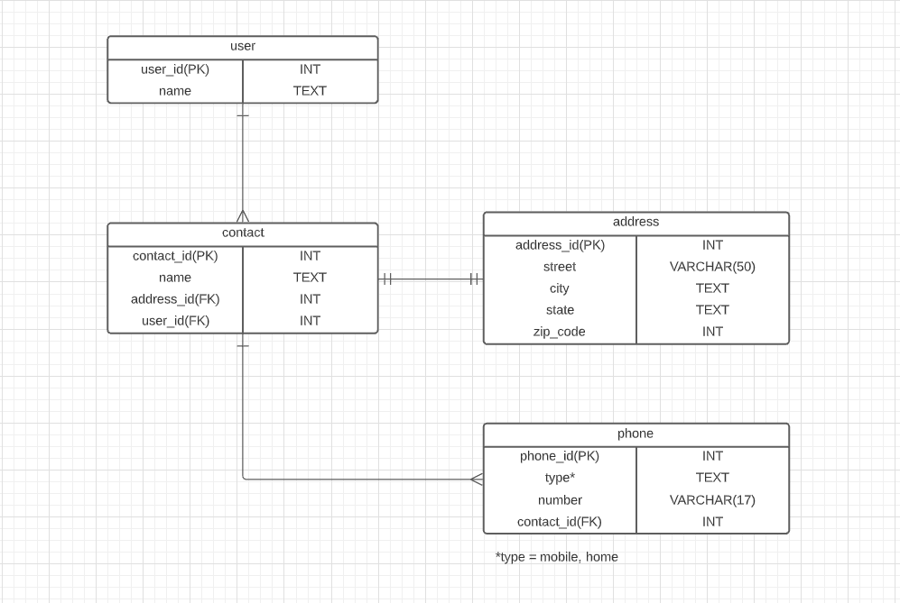

# Phone-Contacts-Service

Project for my bootcamp

## Purpose of this application
This application is designed to manage phone contacts similar to what is available in a smartphone. The user should be able to create new contacts, update those contacts and delete them. 
This project involves using a REST API for a phone contacts database that allows the user to view a full list of contacts.

The project is built using the Model View Controller design (MVC). Following the objective of "Separation of Concerns" allowing the application to communicate for data logic and data access.

When the user sends an API request in Postman the Controller receives it, comunicates it to the Service which interacts with the Java Persistence API (JPA) to store, update and retrieve data in a relational database (postgres).

This project consists of:
* 4 Model Classes
* 4 Controller Classes
* 4 Service Classes
* 4 Repository Interfaces
* 20 API endpoints, all made public.

#### System Tools Used
* Spring Boot
* IntelliJ IDEA/Java
* Lucid App
* Postgres 
* Postman
* Google

#### Dependencies
The project must have the following dependencies inside the pom.xml file:



## Phone Contacts User Stories
As a user I want to be able to create a new phone contact.

* Given that I want to create a new contact
* When I type the new contact information and send the request to the server
* Then the new contact is saved in the database and I will see it on my contacts list

As a user I want to be able to see all of my contacts information.

* Given that I have existing contact information
* When I request the contact information from the server
* Then all the contacts will be display

As a user I want to be able to update my phone contacts according to any changes regarding their personal information.

* Given that I have existing contact information
* When I want to update contact information and send the request to the server
* Then the updated contact is saved in the database and I will see it on my contacts list

As a user I want to be able to delete a contact not longer needed.

* Given that I have existing contact information
* When I want to delete a contact and send the request to the server
* Then the deleted contact is removed from the database and I will not see it on my contacts list anymore

As a user I want to be able to keep a phone contact list.

## Entity Relationship Diagram (ERD)


### Endpoints for User
| Request Type | URL                | Functionality | Request Body |
|--------------|--------------------|---------------|--------------|
| GET          | /api/user          | Get all users | None         |
| POST         | /api/user/         | Create a user | User object  |
| GET          | /api/user/{userId} | Get a user    | None         |
| PUT          | /api/user/{userId} | Update a user | User object  |
| DELETE       | /api/user/{userId} | Delete a user | None         |

### Endpoints for Contact
| Request Type | URL                                    | Functionality       | Request Body   |
|--------------|----------------------------------------|---------------------|----------------|
| GET          | /api/user/{userId}/contact             | Get all contacts    | None           |
| POST         | /api/user/{userId}/contact             | Create a contact    | Contact object |
| GET          | /api/user/{userId}/contact/{contactId} | Get a contact by Id | None           |
| PUT          | /api/user/{userId}/contact/{contactId} | Update a contact    | Contact object |
| DELETE       | /api/user/{userId}/contact/{contactId} | Delete a contact    | None           |

### Endpoints for Address
| Request Type | URL                                                        | Functionality        | Request Body   |
|--------------|------------------------------------------------------------|----------------------|----------------|
| GET          | /api/user/{userId}/contact/{contactId}/address             | Get an address       | None           |
| POST         | /api/user/{userId}/contact/{contactId}/address             | Create an address    | Address object |
| GET          | /api/user/{userId}/contact/{contactId}/address/{addressId} | Get an address by Id | None           |
| PUT          | /api/user/{userId}/contact/{contactId}/address/{addressId} | Update an address    | Address object |
| DELETE       | /api/user/{userId}/contact/{contactId}/address/{addressId} | Delete an address    | None           |

### Endpoints for Phone
| Request Type | URL                                                    | Functionality     | Request Body |
|--------------|--------------------------------------------------------|-------------------|--------------|
| GET          | /api/user/{userId}/contact/{contactId}/phone           | Get all phones    | None         |
| POST         | /api/user/{userId}/contact/{contactId}/phone           | Create a phone    | Phone object |
| GET          | /api/user/{userId}/contact/{contactId}/phone/{phoneId} | Get a phone by Id | None         |
| PUT          | /api/user/{userId}/contact/{contactId}/phone/{phoneId} | Update a phone    | Phone object |
| DELETE       | /api/user/{userId}/contact/{contactId}/phone/{phoneId} | Delete a phone    | None         |

## Sample of data
```
[
    {
        "userId": 1,
        "name": "Tatiana Domingue",
        "contacts": [
            {
                "contactId": 1,
                "name": "Lisa Smith",
                "address": {
                    "addressId": 1,
                    "street": "92 Rock St",
                    "city": "Mountain",
                    "state": "Colorado",
                    "zipCode": 74298
                },
                "phones": [
                    {
                        "phoneId": 1,
                        "type": "mobile",
                        "number": "(498) 921-8758"
                    },
                    {
                        "phoneId": 2,
                        "type": "home",
                        "number": "(478) 521-6532"
                    }
                ]
            }
        ]
    }
]
```

### Problems encountered
When I created a new contact I had a recursion problem which I solved by including @JsonIgnore in my Contact model. 
[I'm an inline-style link] https://www.baeldung.com/jackson-bidirectional-relationships-and-infinite-recursion

When I tried to delete an address the database wasn't allowing me to do it. I solved it by including orphanRemoval = true in my Contact model.
[I'm an inline-style link] https://stackoverflow.com/questions/4329577/how-does-jpa-orphanremoval-true-differ-from-the-on-delete-cascade-dml-clause

The database wasn't allowing me to delete a contact that still has at least one phone number in it. First I tried this: https://stackoverflow.com/questions/6189928/manytoone-jpa-association-and-cascade-not-sure-what-happens-if-i-delete-an-o
which didn't work, so in Contact Service inside the deleteContact method I'm iterating inside the phone list and deleting the phone(s) it contains to then delete the contact. 


